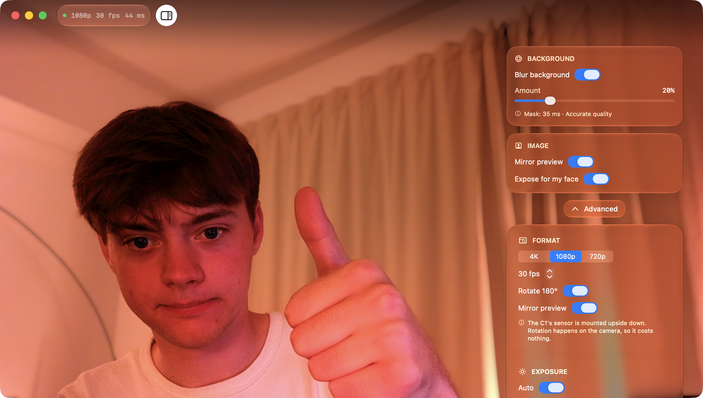

# Open Opal

A native macOS app for the **Opal C1**, which Opal no longer supports.

Composer is abandoned. The hardware is not — and it turns out the C1 is a
perfectly ordinary [Luxonis DepthAI](https://github.com/luxonis/depthai-core)
device underneath, which is open, documented, and still maintained. This app
talks to it directly.



## What it does

Everything Composer's camera controls did, plus a bokeh that actually looks like
a lens:

- **Exposure** — auto/manual, shutter (as a real fraction), ISO, EV compensation, AE lock
- **Focus** — autofocus modes, manual lens position, click-anywhere-to-focus
- **White balance** — auto presets or manual Kelvin
- **Flicker (Hz)** — 50/60Hz anti-banding, for banding under mains lighting
- **Detail** — sharpness, luma and chroma denoise
- **Colour** — brightness, contrast, saturation
- **Format** — 4K/1080p/720p, 5–42fps
- **Bokeh** — depth-aware, aperture and iris shape, blurred in linear light

## Two things it does better than Composer

**It's ~6x lower latency.** The C1's IMX582 has no native 1080p mode — the
smallest thing the sensor produces is 4K. A 4K NV12 frame is ~12.4MB, so 30fps
is ~370MB/s, which saturates USB 3 SuperSpeed. Pull full 4K to the host and you
get this:

| pipeline | resolution | latency (p50) | fps |
|---|---|---|---|
| 4K over USB, then downscale on the host | 3840×2160 | **297 ms** | 20.0 |
| downscale on the camera's ISP first | 1920×1080 | **50 ms** | 30.4 |
| ISP + latest-frame queue | 1280×720 | **44 ms** | 30.4 |

Measured on the real device. The fix is to let the camera's own ISP scale the
frame *before* it crosses the wire (`setIspScale`), and to run a depth-1
non-blocking queue so you always get the freshest frame instead of a backlog.
The app shows its live latency in the status pill, so you can see it yourself.

**The bokeh uses real depth.** Opal ran a small segmentation network on the
camera's Myriad VPU: you were either "person" or "background", so a chair one
metre behind you and a wall six metres behind you got blurred identically. That
flatness is what reads as fake. Instead we run
[Depth Anything V2](https://huggingface.co/apple/coreml-depth-anything-v2-small)
(Apple's Core ML build) to get a continuous depth map, compute a per-pixel circle
of confusion from an actual aperture value, and blur **in linear light** — which
is what lets a specular highlight bloom into a bokeh ball instead of being
averaged into grey mush. Vision's person segmentation is layered on top, not to
do the blurring, but to pin the subject to the focal plane so a noisy depth
estimate can never put a blurry patch on someone's face.

The neural nets run off the render path, so a 25ms inference costs zero
frame-time — worst case the depth map is one frame stale, which is invisible.

## Requirements

- Apple silicon Mac, macOS 26+
- Xcode 26+
- An Opal C1

## Build

```sh
./scripts/bootstrap.sh     # builds depthai-core (first run takes a few minutes)
./scripts/fetch-models.sh  # downloads the Core ML depth model (~50MB)
xcodegen generate
open OpenOpal.xcodeproj
```

## How it talks to the camera

The C1 ships with firmware flashed onto the Myriad X that boots itself and
presents a plain UVC webcam — which is why it works in Zoom with nothing
installed.

Connecting over XLink **reboots the device with our own pipeline**, so while Open
Opal is running, the stock "Opal C1" webcam disappears from macOS and we own the
device. Quit the app and it reboots back into UVC within about five seconds.

Nothing is ever written to flash. The takeover is entirely in RAM, and fully
reversible — the camera cannot be bricked by this app.

```
Myriad X (IMX582)
   │  ColorCamera → ISP downscale → NV12
   │  XLinkIn ← CameraControl (exposure, focus, WB, Hz, …)
   ▼  USB / XLink
OpalBridge (C++ → C shim over depthai-core)
   ▼  NV12 planes
FrameSink → IOSurface-backed CVPixelBuffer      ← the only copy in the path
   ▼
Metal: NV12 → linear RGB → CoC → gather → composite
   │        ↑
   │   Depth Anything V2 + Vision segmentation (async, off the render path)
   ▼
SwiftUI preview
```

## Status

Working: device control, live preview, depth-based bokeh, telemetry.

Not done yet: a **virtual camera** (CoreMediaIO extension) so Zoom/Meet/etc. can
see the processed image. Today the app is a control surface and preview. That's
the next piece.

## Licence

MIT. Not affiliated with Opal Camera Inc.
